```{r setup, include=FALSE}
knitr::opts_chunk$set(echo = FALSE)
```

```{r load_packages, warning=FALSE}
library(vegawidget)
library(reticulate)
library(timevis)
library(kableExtra)
library(knitr)
use_python('/usr/local/bin/python')
```

```{python libraries_import, include=FALSE}
import pandas as pd
import numpy as np
import altair as alt

```

## Introduction | The Survey

<div class= "columns-2">
<center>

</center>
<br>  

**Work Environment Survey (WES)**  
 
  - Conducted by BC Stats for employees within BC Public Service
  
  - Measures the health of work environments and identifies areas for improvement
  
  - ~80 quantitative questions (5 Likert scale) and 2 open-ended qualitative questions
  
</div>


## Data | Open-ended Questions

**Question 1**

- <b> <span style="color:#005c99">
What one thing would you like your organization to focus on to improve your work environment? </span></b>

Example: *"Better health and social benefits should be provided."*

<br>
**Question 2**

- <b> <span style="color:#005c99">
Have you seen any improvements in your work environment and if so, what are the improvements? </span> </b>

Example: *"Now we have more efficient vending machines."*

<br>
<br>

<font size="3"> *Note: these examples are fake comments for privacy reasons. </font>


## Example of Data: Question 1
<font size="3.5"> <b> 
<span style="color:#005c99">
What one thing would you like your organization to focus on to improve your work environment? </span> </b> </font>


|Comments*|CPD|CB|EWC|...|CB_Improve_benefits|CB_Increase_salary|
|:----|:---:|:---:|:---:|:---:|:---:|:---:|
|Better health and social benefits should be provided|0|1|0|...|1|0|

<br>
<font size="4"><span style="color:#005c99">**Theme**: CB = Compensation and Benefits</span></font>

<font size="4"><span style="color:#005c99">**Subtheme**: CB_Improve_benefits = Improve benefits</span></font>
<br>
<br>

**Question 1:** 

  - Comments encoded into <span style="color:#005c99">12 themes </span>and <span style="color:#005c99">63 subthemes</span>
  - <span style="color:#005c99">+31,000 </span>labelled comments for 2013, 2018, 2020, <span style="color:#005c99">+12,000 </span>additional comments from 2015

**Question 2:**

  - Themes also encoded, but not as reliable as Question 1's
  - <span style="color:#005c99">+6,000 </span>labelled comments for 2018, <span style="color:#005c99">+9,000 </span>additional comments from 2015, 2020

<font size="3"> *Note: this is a fake comment as an example of the data. </font>


## Our Objectives 
<br>
**<font size="5"> 1) Build a model to automate multi-label text classification that: </font> **

- Predicts label(s) for Question 1 and 2's main <span style="color:#005c99">themes</span>

- Predicts label(s) for Question 1's <span style="color:#005c99">subthemes</span>

<br>

**<font size="5"> 2) Build an app for visualizations of text data:</font>**

- Identify and compare <span style="color:#005c99"> common words </span> used for each question

- Identify <span style="color:#005c99"> trends on concerns (Q1) </span>and <span style="color:#005c99">appreciations (Q2)  </span> for BC ministries over the given years 


## Challenges with data| 1) Sparsity

<div class= "columns-2">

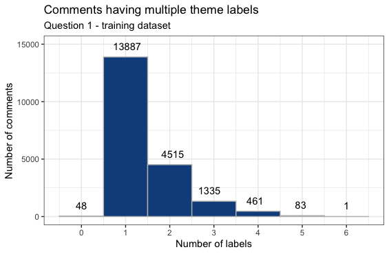

<br>

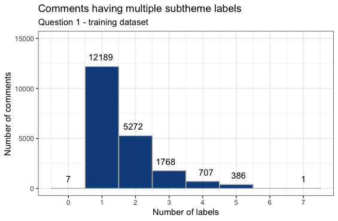
</div>
**<span style="color:#005c99">There are 12 themes and 62 subthemes that comments can be encoded into.</span>**

<font size="4"> 

- Average number of labels per comment: **Themes = ~1.4**  ,  **Subthemes = ~1.6**</font>


## Challenges with data| 2) Class Imbalance
<center>
  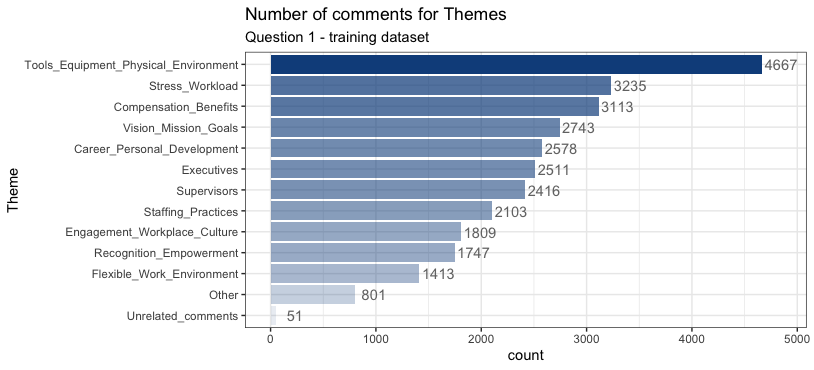
</center>


## Text classification methodology

<center>
  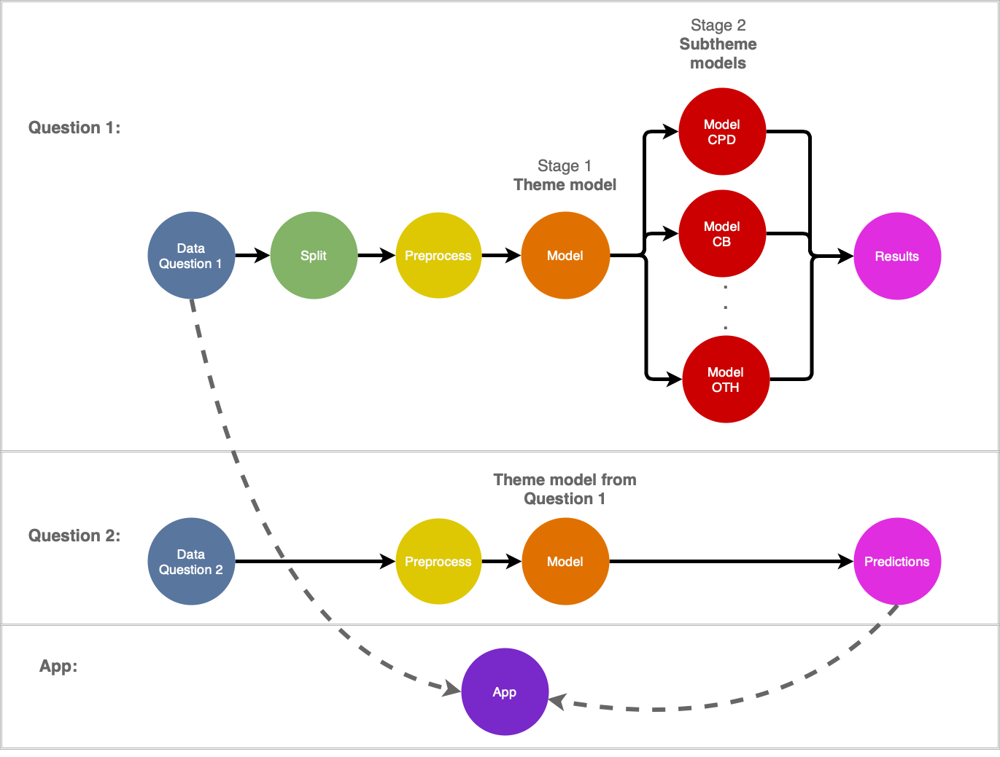
</center>


## Data Split & Preprocess
<center>
  
</center>
<br>

- Raw -> 80% train, 20% test.   
- Training -> 80% train, 20% validation

<br>

- removed<span style="color:#005c99"> sensitive information </span> using <span style="color:#005c99">Named Entity Recognition (NER) </span>to remove person, organization, location, and geopolitical entity

<br>
<br>
<br>
<font size="4">Example comment to get flagged: 
<b>"George and I love when the department gives us new coupons!"</b></font>
                

## Modelling Techniques

<center>
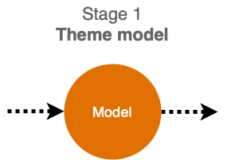
</center>
<br>

- <font size="5">**Baseline models**:</font> used<span style="color:#005c99"> **TF-IDF Vectorizer**</span> and traditional machine learning classifiers (RandomForest, GaussianNB, etc)
    - best results with <span style="color:#005c99">**LinearSVC**</span>

<br>

- <font size="5">**Deep Learning models**:</font> ran multiple models including <span style="color:#005c99">**CNNs** and **sequential models**</span> with pre-trained embeddings 


## Pre-Trained Embeddings

#### <span style="color:#005c99">**Fasttext, Glove, Universal Sentence Encoder**</span>

<br>

<div class= "columns-2">
<br>
<center>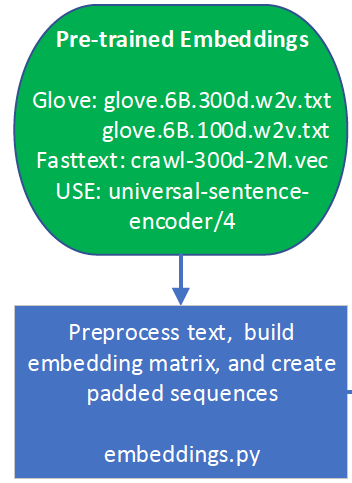
</center>

<br>

- **Fasttext**: trained on Common Crawl 

- **Glove**: trained on Wikipedia and Gigaword (newswire text)

- **Universal Sentence Encoder**: trained on Wikipedia and Common Crawl 

- Built embedding matrixes & transformed comments to padded sequential data to fit into embedding size. 


## Deep Learning Models

<span style="color:#005c99"> **BiGRU**</span>

- <font size="4">**GRUs:** preserves order of words and has 2 gates (reset gate and update gate)</font>
- <font size="4">**Bidirectional GRUs**: Uses sentence sequences from both left-to-right and right-to-left </font>

<br>

<center>
  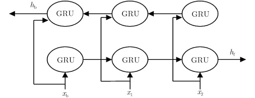
</center>

<br>

<font size="3">*Source: [Bi-directionalGated Recurrent Unit](http://jeit.ie.ac.cn/article/app/doi/10.11999/JEIT180978?viewType=HTML&pageType=en)*</font>


## Deep Learning Models 

<span style="color:#005c99">**Multichannel CNNs**</span>

- <font size="4"> Multiple versions of standard CNN models with different kernel sizes.</font>
- <font size="4"> Specifically, we have defined a model with 3 input channels for kernel sizes 4, 6 and 8</font>

<center>
  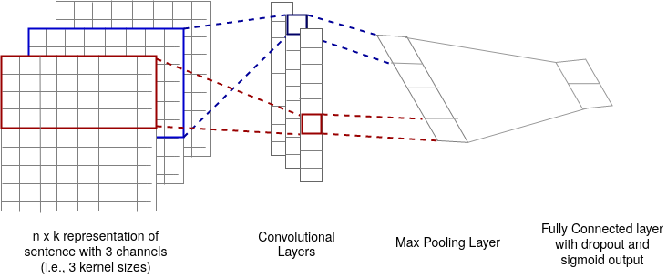
</center>

<br>

- <font size="3"> &nbsp; &nbsp; &nbsp; n - number of words , k - dimension of the word embedding</font>


##  How we measured success| Precision & Recall

<div class= "columns-2">
<center>
  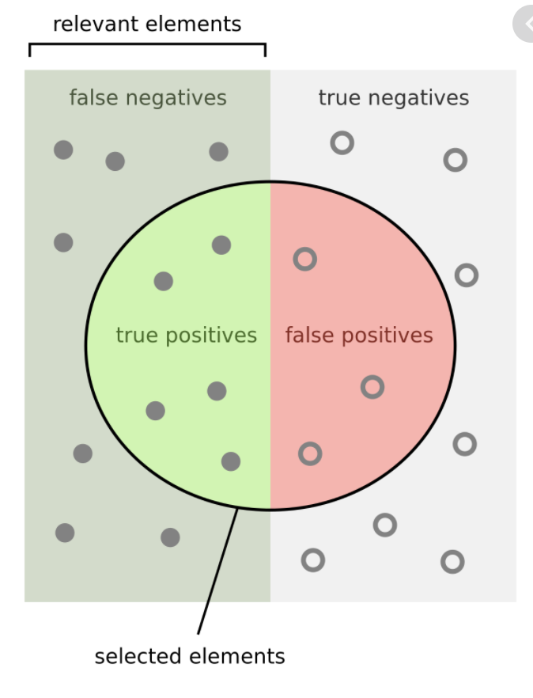
</center>
  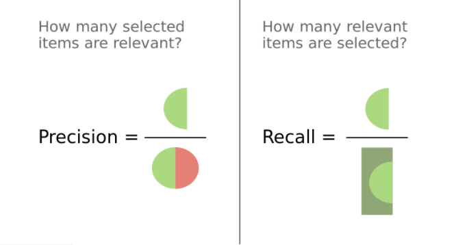
  
  - <span style="color:#005c99">Precision Recall curve: </span> plotting precision vs recall at various threshold rates
  
  - <span style="color:#005c99">Micro-average: </span> weighted average of the precision and recall
</div>

<font size="3">*Source: [Precision and Recall](https://en.wikipedia.org/wiki/Precision_and_recall)*</font>


## Precision Recall Curve for Q1 Theme Models

<center>
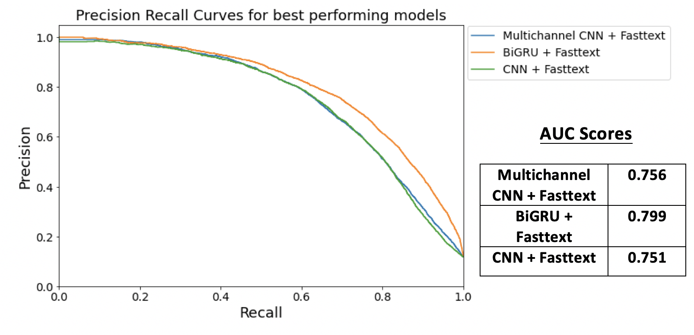
</center>


## Advanced Model: Fasttext + BiGRU

<center>
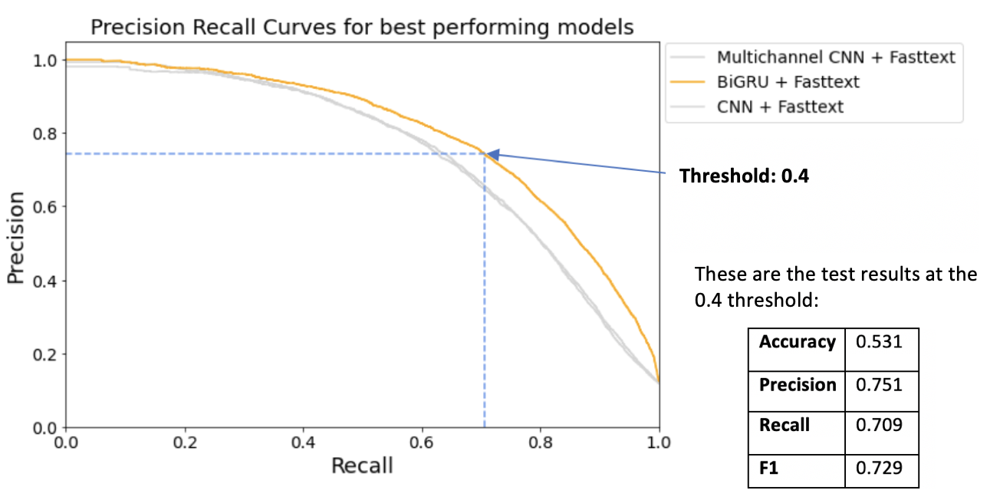
</center>


## Results for Theme Labelling Models

<br>

<div class= "columns-2">

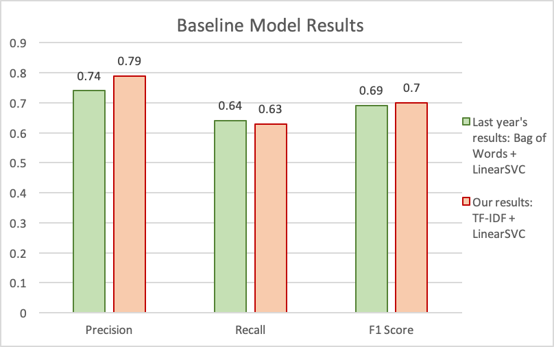

<br>

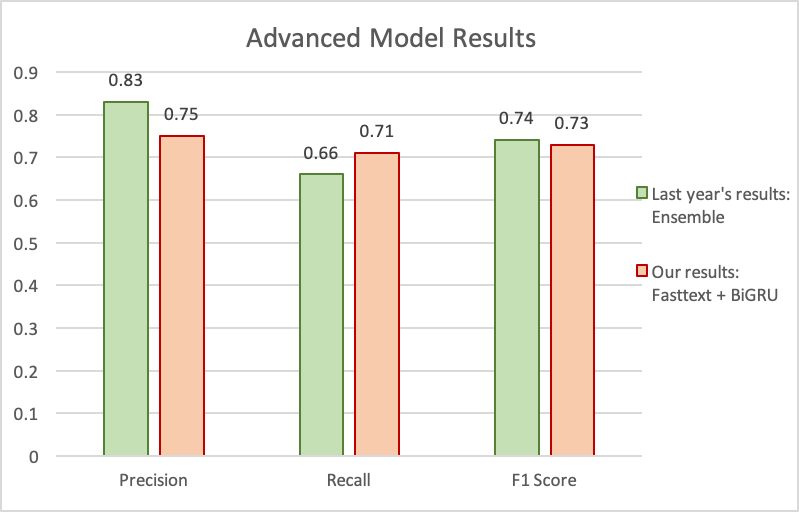


</div>

<font size="3">*Source: [BC Stats Capstone 2019-Final Report, by A. Quinton, A. Pearson, F. Nie](https://github.com/aaronquinton/mds-capstone-bcstats/blob/master/reports/BCStats_Final_Report.pdf)*</font>


## Label Wise Results for Fasttext + BiGRU | Predicting each theme 

<div class= "columns-2">


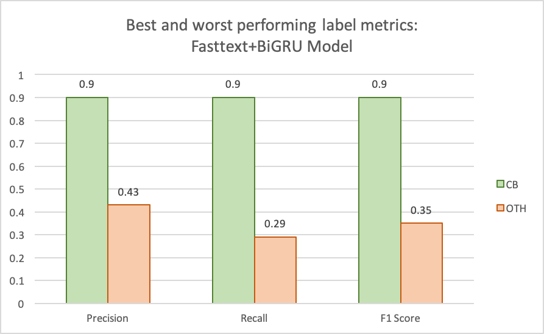

<br> 

- <font size="4"> &nbsp; Themes with high F1 scores (CB) can be encoded <span style="color:#005c99">**automatically using the model**</span>, while themes with lower scores (OTH) can be <span style="color:#005c99">**manually verified**</span> by BC Stats. </font>

- <font size="4"> &nbsp; Recommendation to use a <span style="color:#005c99">**combination of machine learning and manual encoding.**</span></font>

- <font size="4">&nbsp; Rest of the themes have the following ranges:</font>
  - <font size="4"><span style="color:#005c99">&nbsp; **Precision: 0.69-0.92**</span></font> 
  - <font size="4"><span style="color:#005c99">&nbsp; **Recall: 0.51-0.85**</span></font>

</div>


## Building Subtheme Models | Hierarchical approach

<div class= "columns-2">

<center>
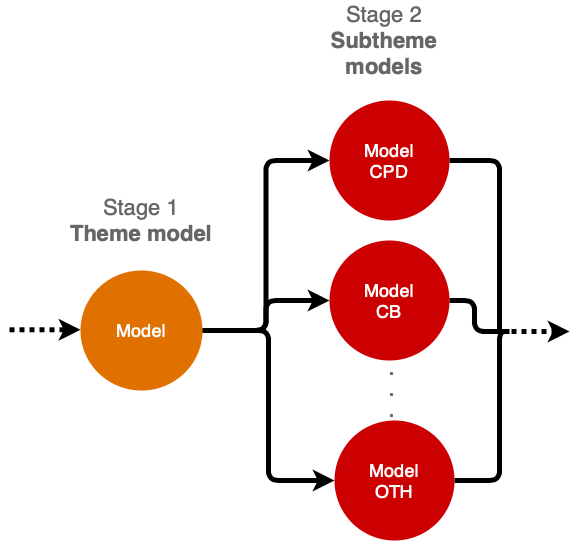
</center>

<br>

**Subthemes are predicted based on the theme(s) our model has assigned to the comment.**

</div>


## Precision Recall Plot for Subtheme Models
<center>
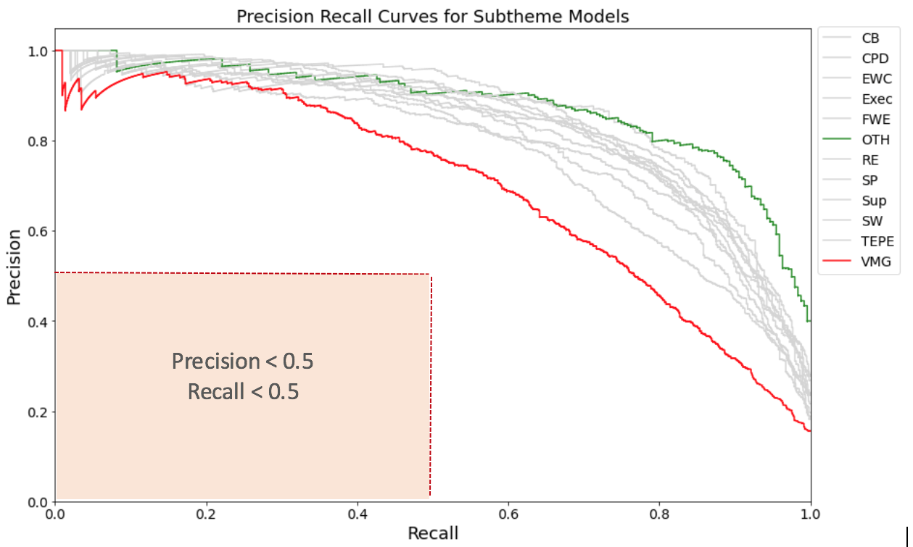
</center>

- <font size="4">The minimum desirable of both precision and recall values shared by BC Stats for labelling subthemes was 0.5. </font>
- <font size="4">**All subtheme models surpassed this threshold.**</font>


## Subtheme models results 

<center>
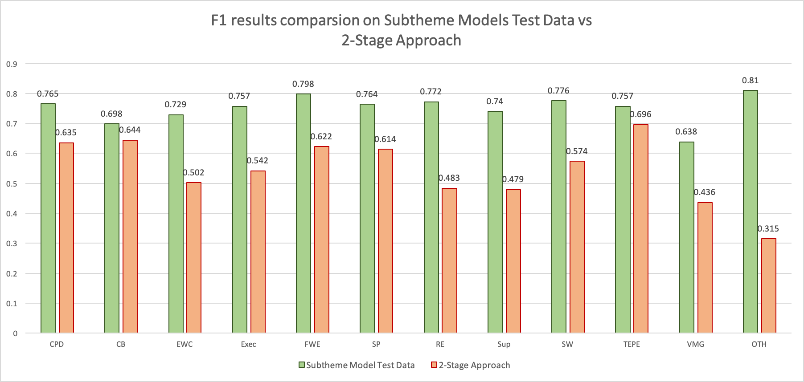
</center>

- $F1 = 2 * \dfrac{precision * recall}{precision + recall}$

- Increasing data for label OTH will improve results


## Comparing Question 2 to Question 1

<center>
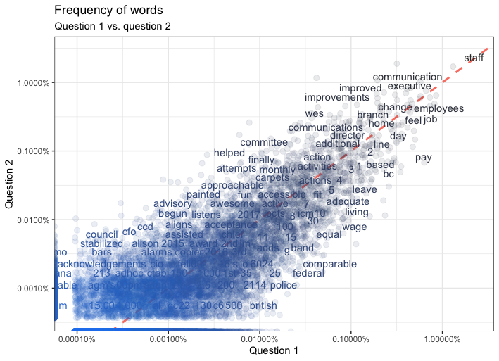
</center>

- <font size="4">Observed a <span style="color:#005c99">**linear trend**</span> in frequency of common words between Question 1 and Question 2.</font>

- <font size="4">Validated <span style="color:#005c99">**using the themes from Question 1 **</span> to label comments from Question 2.</font>


## Question 2: Predicting Themes
<center>
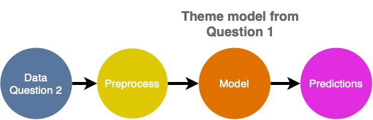

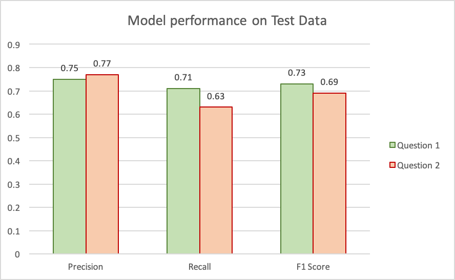
</center>


## Dashboard

<center>
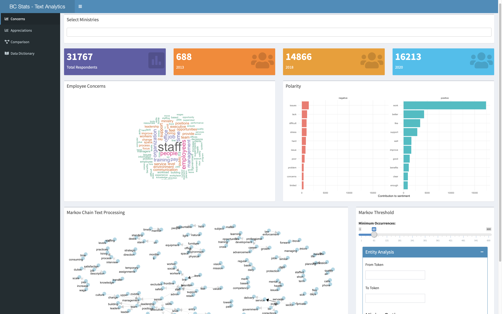
</center>


## Methodologies that did not work

- <span style="color:#005c99"> **Overfitting**</span> in **CNNs** and **multi-channel CNNs**
- <span style="color:#005c99">**Universal Sentence Encoder**</span> embeddings 
- <span style="color:#005c99">**Topic modelling** </span> for Question 2 (too much overlap in words, ambiguity)

<center>
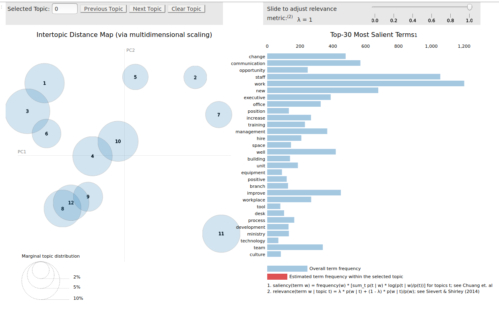
</center>


## Recommendations & Conclusions

- Expected to observe better results with **more data** 
    - will improve results for subthemes using hierarchical approach

<br>

- Use model to automate labelling on themes and subthemes with high precision and recall 
    - **CB, TEPE, CPD, SP,** and **FWE** (for theme model)
    - manually encode or verify model's results on other comments 


## Thank you. Questions?

<center>
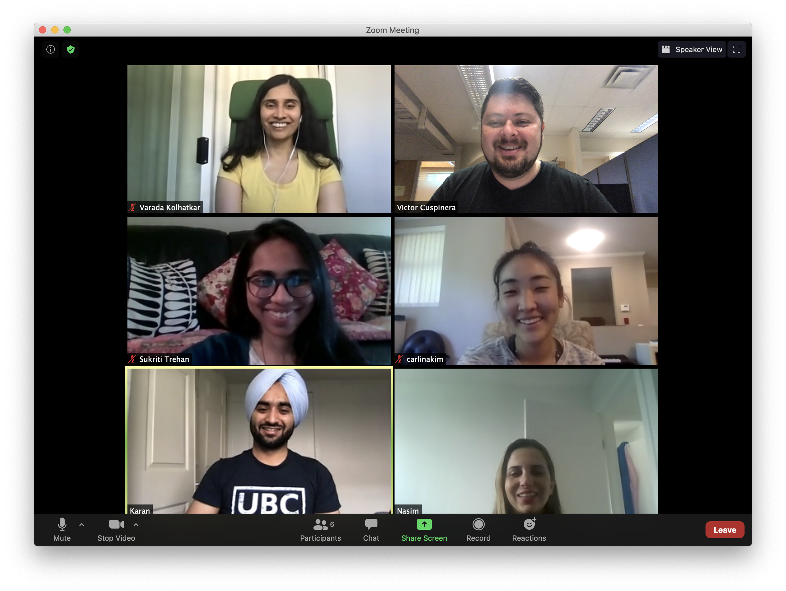
</center>


## Appendix A: Theme Model threshold levels 

Results on various threshold values using validation data

<center>

```{r}
thresholds <- read.csv('tables/theme_tables/theme_valid_eval.csv')

gridExtra::grid.table(thresholds[2:6])

#table <- kable(thresholds[2:6],'html') %>%
#  kableExtra::kable_styling(latex_options = c("striped")) %>%
#  kableExtra::row_spec(2, bold = T, color = "white", background = "#D7261E")

```

</center>
