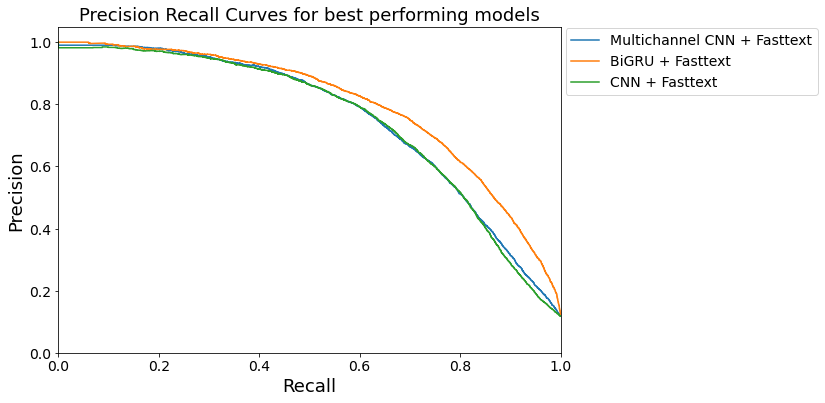

```{r setup, include=FALSE}
knitr::opts_chunk$set(echo = TRUE)
```

```{r load_packages, warning=FALSE, include=FALSE}
library(reticulate)
use_python('/usr/local/bin/python')
```

```{r, echo=FALSE ,message=FALSE}
#load needed packages
library(dplyr)
library(knitr)
```

## Executive Summary

BC Stats conducts the Work Environment Survey (WES) for BC Public Service’s ministries with the goals of identifying areas for improvement and understanding employee’s experiences. We have used natural language processing and machine learning classification techniques to automate labelling of responses to the open-ended questions into various themes and subthemes. These models may be used on their own or to assist human annotators to speed up the manual labelling process. We have also developed an app to explore the data with visualizations. 

## Introduction

The BC Public Service commits to maintaining the health of work environments and identifying areas for improvement through the Work Environment Survey (WES). The survey consists of ~80 quantitative questions using a 5 Likert scale and two open-ended qualitative questions, shown below, which have not been fully looked into by BC Stats. Due to this, we are solely focusing on these qualitative questions.

***Question 1:*** 
*"What one thing would you like your organization to focus on to improve your work environment?"* 

***Question 2:***
*"Have you seen any improvements in your work environment and if so, what are the improvements?"*

BC Stats has been manually encoding the responses to these questions into various themes and subthemes, which is time consuming and expensive. We propose using multi-label machine learning classifiers and natural language processing to automate this process. We compare our results of classifying main themes with the results obtained by last year’s MDS Capstone group, who worked on the same problem. In addition, we explored two problems which were not explored last year. First, we propose an approach to classify subthemes, and second, we propose an approach to classify responses of Question 2. Accordingly, our objectives are as follows:

**Our Objectives**

1) Build a model to automate multi-label text classification that:
    - Predicts label(s) for Question 1 and 2’s main themes
    - Predicts label(s) for Question 1’s subthemes

2) Build an app for visualizations of text data:
    - Identify and compare common words used for each question
    - Identify trends on concerns (from Question 1 responses) and appreciations (from Question 2 responses) in BC ministries workplaces over the given years. 

**Data**

There are 31,000+ labelled comments (2013, 2018, 2020) and 12,000+ additional unlabelled comments (2015) for Question 1. Question 2 has 6,000+ labelled comments (2018) and 9,000+ additional unlabelled comments (2015, 2020). The 12 theme and 63 subtheme labels for Question 1 have been used in the past and deemed reliable by BC Stats, whereas Question 2’s themes needed further analysis.

\newpage

## Data Science Methodology

**Multilabel-Theme Classification**

Our main approach involves using [multi-label theme classification](https://en.wikipedia.org/wiki/Multi-label_classification) methods. We first develop a theme model that labels the survey comments into their predicted themes. Next, we follow a top-down approach where we define a hierarchical two-stage model to predict the subthemes. In stage 1, we predict the themes for the comments using the main theme model. In stage 2, based on the predicted themes from stage 1, we further classify the comment down into their respective subthemes. 

We handled sensitive information in our preprocessing step using [Named Entity Recognition](https://towardsdatascience.com/named-entity-recognition-with-nltk-and-spacy-8c4a7d88e7da) to anonymize the comments. We used traditional feature-based classifiers as well as pre-trained embeddings and deep-learning classifiers to produce our models.  

**Baseline Models: TF-IDF Vectorizer + LinearSVC**

For our baseline approach, we used a multi-labelling method called [Classifier Chains](https://link.springer.com/chapter/10.1007/978-3-642-04174-7_17), which models correlations between the multiple labels. [TF-IDF Vectorizer](https://en.wikipedia.org/wiki/Tf–idf) creates a sparse representation of text with TF-IDF features that weighs most interesting words more. We use this representation with Classifier Chains and [linear support vector classifier](https://pythonprogramming.net/linear-svc-example-scikit-learn-svm-python/) (LinearSVC), which is our baseline model. Other traditional models such as RandomForest and GaussianNB resulted in either slow training times or low results.

**Advanced Models: Pre-trained Embeddings + Deep Learning Models**

Other than TF-IDF representation, we also explored semantically richer text representations with word and text embeddings such as [GloVe](https://nlp.stanford.edu/projects/glove/), [FastText](https://fasttext.cc/) and [Universal Sentence Encoder](https://tfhub.dev/google/universal-sentence-encoder/4). These were used to build embedding matrixes and padded data to fit into the embeddings sizes. This was important as it allowed us to upload our sensitive data onto public cloud services (Google Colab) to apply more computationally expensive deep learning models. The advanced models we explored were [Multi-channel CNNs](https://machinelearningmastery.com/develop-n-gram-multichannel-convolutional-neural-network-sentiment-analysis/), [CNNs](https://en.wikipedia.org/wiki/Convolutional_neural_network), and [Bidirectional GRUs](https://medium.com/@felixs_76053/bidirectional-gru-for-text-classification-by-relevance-to-sdg-3-indicators-2e5fd99cc341#:~:text=Bidirectional%20GRU's%20are%20a%20type,predictions%20about%20the%20current%20state.&text=Gated%20Recurrent%20Unit%20(GRU)%20for%20Emotion%20Classification%20from%20Noisy%20Speech.) or Bi-GRUs. 

Multi-channel CNNs are multiple versions of standard CNN models. For our model (Figure 1), we have used different kernel sizes for each channel. Specifically, we have defined a model with 3 input channels for kernel sizes 4, 6, and 8. 

<p>
{width=80%}
</p>

Figure 1: Visual representation of our multi-channel CNNs with kernel sizes 4, 6, and 8.

<br>

The GRU part of Bi-GRUs are similar to LSTMs, with the major difference being that GRUs have 2 gates (reset gate and update gate) instead of 4 (forget, input, update, output). Bidirectional means the model uses sentence sequences from both left-to-right and right-to-left to better represent the overall context of the word.  We achieved the best results with the FastText embeddings trained on a common crawl with Bi-GRU. 

**Comparing Question 2 to Question 1:**

Question 2 posed several challenges as the inital themes for this question were deemed unreliable to cover the full scope of the problem. Additionally, BC Stats wanted Question 2's themes to align better with themes from Question 1. To address this, we compared the words used and the frequency of these words in the responses for both questions. 

The plot below (Figure 2) shows a linear trend in the frequency of common words between Question 1 and Question 2. For example, the word “communication” would appear approximately 1 out of 100 words read in the comments for both questions. We also assume concern and appreciation within the workforce focus on similar topics. The similarity in the vocabulary and frequency of words supported our decision to use our theme model developed using Question 1's themes for Question 2's predictions. 

<p>
{width=90%}
</p>

Figure 2: Frequency word comparison chart for responses from both questions.

## Data Product and Results 

Our data product consists of five components: trained theme and subtheme models, a pipeline to evaluate the models, a pipeline to classify new comments, an app that summarizes the text data with visualizations, and a report detailing the methodologies and results.

**Results for Theme Labelling Models**

As our data contained sparsity and class imbalance, accuracy does not represent the true underlying results due to false positives and negatives. Therefore, we measured the success of our models using precision and recall. Precision shows the average proportion of predictions that are correct. Recall shows the average proportion of all the correct labels that were predicted. We focused on balancing the precision and recall results for our models.

We also used precision recall curves to determine our deep learning model. Figure 3 shows the results for our deep learning models using FastText embeddings. Our best performing model was FastText + BiGRU shown as the highest curve on the precision recall plot.  

<p>
{width=90%}
</p>

Figure 3: Precision recall curve showing results at various thresholds of our deep learning models using FastText embeddings using validation data. BiGRU + FastText performed the best results. 

<br>

The table below shows the results of the BiGRU + FastText being evaluated at various thresholds on the validation set. 

Table 1: Evaluation of Bi-GRU + FastText model at various thresholds.
```{r, echo = FALSE}
thresholds <- read.csv('tables/theme_tables/theme_valid_eval.csv')

kable(thresholds[2:6]) #%>%
  #kableExtra::kable_styling(latex_options = c("striped")) #%>%
  #kableExtra::row_spec(2, bold = T, color = "white", background = "#D7261E")
```

<br>

At the 0.4 threshold, our model observed the best precision and recall scores of 0.744 and 0.705 respectively. We used these values at threshold 0.4 for our theme model. 

Below are our results for the baseline and deep learning model. We compared our results to last year's capstone results. The baseline models performed similarly while we have increased our recall score in our advanced model. This was part of our goal as increasing recall reduces the false negatives on our data. 

<p>
{width=100%}
</p> 

<p>
{width=100%}
</p>

Figure 4: Comparison bar charts of our model's and [last year's capstone group's](https://github.com/aaronquinton/mds-capstone-bcstats/blob/master/reports/BCStats_Final_Report.pdf) model's performance on their precision, recall and F1 scores. 


```{r, evaluate = FALSE, include=FALSE}
baseline <- read.csv("tables/baseline_results.csv")

kable(baseline[1,] %>%
        select(Model, Test.Accuracy, Test.Recall,
               Test.Precision, Test.F1))

advanced <- read.csv("tables/theme_tables/theme_pred_test_results.csv")

advanced
```

<br> 
<br>
<br>

\newpage


The label-wise results below (Table 2) indicate that most themes have high precision and recall. **"Y_count"** is the test data's true number of comments in the theme, **"Pred_count"** is how many comments our model predicted, and **"Y_count_train"** is the number of training data the model had for each theme. 

Table 2: Prediction on test set for our main theme models performance for labelling each theme
```{r echo=FALSE}
themes <- read.csv('tables/theme_tables/themewise_test_pr.csv')

kable(themes %>%
        arrange(desc(F1.Score))) 

```

When using the model, theme comments with high precision and recall scores (> 0.67) do not need to be confirmed and can be encoded automatically. The themes with precision and recall scores above 0.67 are **CB, TEPE, CPD, SP, FWE**. We are confident that the model is prone to less error when predicting these.

Themes with lower precision and recall scores such as **OTH** should be manually verified by the BC Stats team. For OTH theme, is it the case that the model performs poorly because it is a catchall category and probably the model was unable to find patterns for this category. We recommend using a combination of both machine learning and human annotators for optimal results. 

**Results for Subtheme Models**

We've built 12 independent models for each theme with their respective subthemes. These models will be used on the comment depending on the theme it was labelled to in stage 1. Majority of these models showed best results using FastText + BiGRU, except for the subthemes in theme `CB` which used FastText + CNN.  

The precision recall curve shows the test results for all of the subtheme models. The minimum desirable threshold for the subtheme models precision and recall values shared by BC Stats was both 0.5. All our subtheme models surpass this threshold, when predicting on the test comments with their true main themes. 

<p>
{width=90%}
</p>

Figure 5: Precision recall curve for best performing subtheme models which all passes BC Stat's satisfaction condition (> 0.5).  

<br>


Below are our results using the 2-stage hierarchical approach. The following results are based on the test data after themes for the comments have been predicted using the main theme model.  


<br>

Table 3: Results of subtheme models performance during 2nd stage of hierarchical approach. After comments have been predicted using the main theme model. 
```{r, echo= FALSE}

subthemes <- read.csv("tables/subtheme_tables/subtheme_pred_results.csv")

kable(subthemes[2:6] %>%
  arrange(desc(F1.Score)))
```

Despite OTH having the best precision and recall curve shown in Figure 4, we have achieved low results using our hierarchical 2-stage approach. This is due to error from the main themes model being propagated into our 2nd stage of our hierarchical model. The theme OTH had low precision and recall in our themes model which can be attributed to its small sample size. We believe that increasing the sample size may lead to increase in precision and recall metrics. 

\newpage

**Predicting Themes for Question 2**

We evaluated Question 2’s labelling with Question 1’s themes using a sample data of annotated comments provided by BC Stats using 2020 survey responses. The comparison of the results are close in range and hence appropriate to use the main theme model for Question 2 as well. 

<p>
{width=90%}
</p>

Figure 6: The bar graph compares how the main theme model performed predicting for both Question 1 and Question 2. 

<br>

**Dashboard**

The dashboard provides a way for BC Stats to explore the summarized text data. There are 3 tabs, Concerns, Appreciations, and Comparison. The Concerns and Appreciations tabs looks into Question 1 and 2 respectively. Within each tab, we show the common texts in the comments using word cloud, interactions between relevant words using word ngrams, sentiment analysis of comments. In the Comparisons tab, you can compare the concern and appreciations expressed in each theme for the ministries over the given years. For example, you can see whether the theme Compensation and Benefits increased or decreased in appreciations and concerns for your ministry of interest from 2013-2020. 

<p>
{width=80%}
</p>

Figure 7: First page of our dashboard

<br>

## Conclusions and Recommendations

**Classification Models**

We've built several models to help the process of manually labelling survey questions. Although we haven't fully achieved a perfect model, it would make the manual labeling process easier and faster. Specifically, comments can be automatically encoded into themes
**CB, TEPE, CPD, SP,** and **FWE** as they had precision and recall values ranging between 0.73-0.90 in the main theme model. 

Our subtheme model, although had promising results during training, faced the consequences of the errors prior in the main theme model step. However, they were all able to perform higher than the minimum requirement desired by BC Stats. Particularly for subthemes models that performed low, such as OTH, we expect better results with more data. 

We also recommend creating embeddings and padded data on sensitive data so it can be uploaded into public cloud services (Google Gollab, AWS). This can allow more complex machine learning algorithms to be incorporated to improve the model.

\newpage


## References

- [BC Stats. (August 2018). 2018 Work Environment Survey Driver Guide.](https://www2.gov.bc.ca/assets/gov/data/statistics/government/wes/wes2018_driver_guide.pdf)

- [Province of British Columbia. (2020). About the Work Environment Survey (WES). Retrieved 2020-05-09](https://www2.gov.bc.ca/gov/content/data/statistics/government/employee-research/wes/)

- [Quinton, A., Pearson, A., Nie, F. (2019). BC Stats Capstone Final Report, Quantifying the Responses to Open-Ended Survey Questions. GitHub account of Aaron Quinton.](https://github.com/aaronquinton/mds-capstone-bcstats/blob/master/reports/BCStats_Final_Report.pdf)

- [Read J., Pfahringer B., Holmes G., Frank E. (2009) Classifier Chains for Multi-label Classification.](https://link.springer.com/chapter/10.1007/978-3-642-04174-7_17)

- [Wikipedia. (2020, May 3). Multi-label classification. In Wikipedia, The Free Encyclopedia. Retrieved 2020-05-15.](https://en.wikipedia.org/wiki/Multi-label_classification)

- [Linear SVC Machine learning SVM example with Python](https://pythonprogramming.net/linear-svc-example-scikit-learn-svm-python/)

- [Brownlee J. (December, 2019) How to Develop a Multichannel CNN Model for Text Classification](https://machinelearningmastery.com/develop-n-gram-multichannel-convolutional-neural-network-sentiment-analysis/)

- [Wikipedia. (2020, June 14). Convolutional neural network. In Wikipedia, The Free Encyclopedia. Retrieved 2020-06-22.](https://en.wikipedia.org/wiki/Convolutional_neural_network)

- [Silwimba F. (October, 2018) Bidirectional GRU for Text classification by relevance to SDG#3 indicators.](https://medium.com/@felixs_76053/bidirectional-gru-for-text-classification-by-relevance-to-sdg-3-indicators-2e5fd99cc341#:~:text=Bidirectional%20GRU's%20are%20a%20type,predictions%20about%20the%20current%20state.&text=Gated%20Recurrent%20Unit%20(GRU)%20for%20Emotion%20Classification%20from%20Noisy%20Speech.)

- [Li S. (2018) Named Entity Recognition with NLTK and SpaCy](https://towardsdatascience.com/named-entity-recognition-with-nltk-and-spacy-8c4a7d88e7da)
